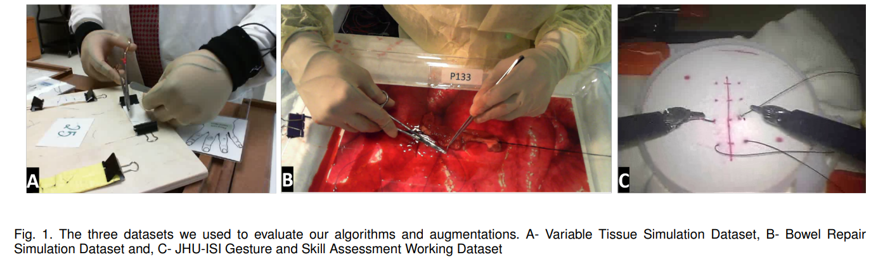
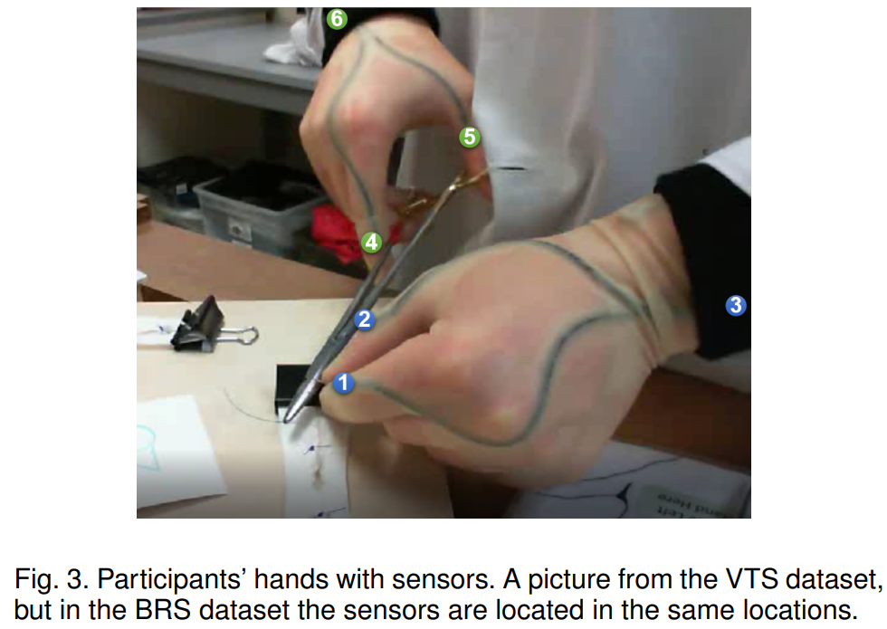

# Kinematic Data-Based Action Segmentation for Surgical Applications
This manuscript is presently being reviewed by a peer-reviewed journal.


A PyTorch implementation of the paper [Kinematic Data-Based Action Segmentation for Surgical Applications](https://arxiv.org/pdf/2303.07814.pdf).

Action segmentation is a challenging task in high-level process analysis, typically performed on video or kinematic data obtained from various sensors. In the context of surgical procedures, action segmentation is critical for workflow analysis algorithms. This work presents two contributions related to action segmentation on kinematic data. Firstly, we introduce two multi-stage architectures, MS-TCN-BiLSTM and MS-TCN-BiGRU, specifically designed for kinematic data. The architectures consist of a prediction generator with intra-stage regularization and Bidirectional LSTM or GRU-based refinement stages. Secondly, we propose two new data augmentation techniques, World Frame Rotation and Horizontal-Flip, which utilize the strong geometric structure of kinematic data to improve algorithm performance and robustness. We evaluate our models on three datasets of surgical suturing tasks: the Variable Tissue Simulation (VTS) Dataset and the newly introduced Bowel Repair Simulation (BRS) Dataset, both of which are open surgery simulation datasets collected by us, as well as the JHU-ISI Gesture and Skill Assessment Working Set (JIGSAWS), a well-known benchmark in robotic surgery. Our methods achieve state-of-the-art performance on all benchmark datasets and establish a strong baseline for the BRS dataset.





## Install
This implementation uses Python 3.6 and the following packages:
```
opencv-python==4.2.0.32
optuna==2.8.0
numpy==1.19.5
torch==1.8.1
pandas==1.1.5
wandb==0.10.33
tqdm==4.61.2
termcolor==1.1.0
```
We recommend to use conda to deploy the environment

## VTS Dataset
[Data request](https://docs.google.com/forms/d/e/1FAIpQLSeKvalfDwLBkxh1PgrVH14wu2a8UXl7xi0bSAYEU0z9yPrdUA/viewform?usp=sf_link/)


## Run the code
To train and test the model on all the splits run:
```
python train_experiment.py
```
The visualization result is located in `summaries/APAS/experiment_name`,
Where `experiment_name` is a string describing the experiment: the network type, whether it is online, etc.

## Citation
```
@article{goldbraikh2023kinematic,
  title={Kinematic Data-Based Action Segmentation for Surgical Applications},
  author={Goldbraikh, Adam and Shubi, Omer and Rubin, Or and Pugh, Carla M and Laufer, Shlomi},
  journal={arXiv preprint arXiv:2303.07814},
  year={2023}
}
